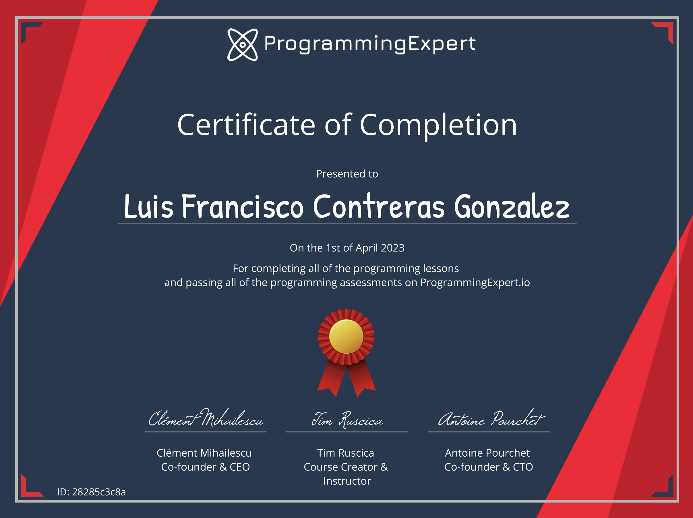

# programmingexpert.io

This project contains the problem sets and projects from [programmingexpert.io.](https://www.programmingexpert.io/product)

Topics include:

- Programming Fundamentals
- Object-Oriented Programming
- Advanced Programming
- Software Design
- Software Engineering Tools
- Projects

It also contains extra practice programs I use to improve on the concepts from programmingExpert.

All of this using Python programming language.

https://certificate.algoexpert.io/ProgrammingExpert%20Certificate%20PE-28285c3c8a

For more certifications and complete profile please check my LinkedIn: https://www.linkedin.com/in/luis-francisco-contreras-gonzalez-45791715a/
